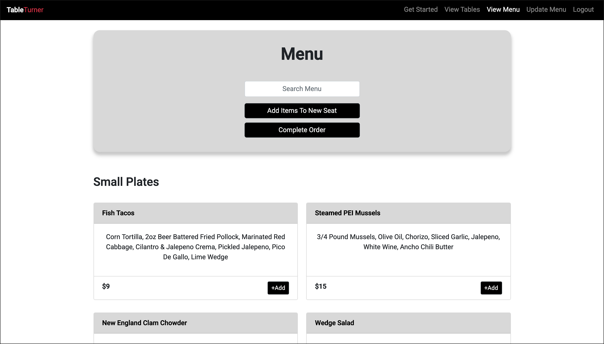
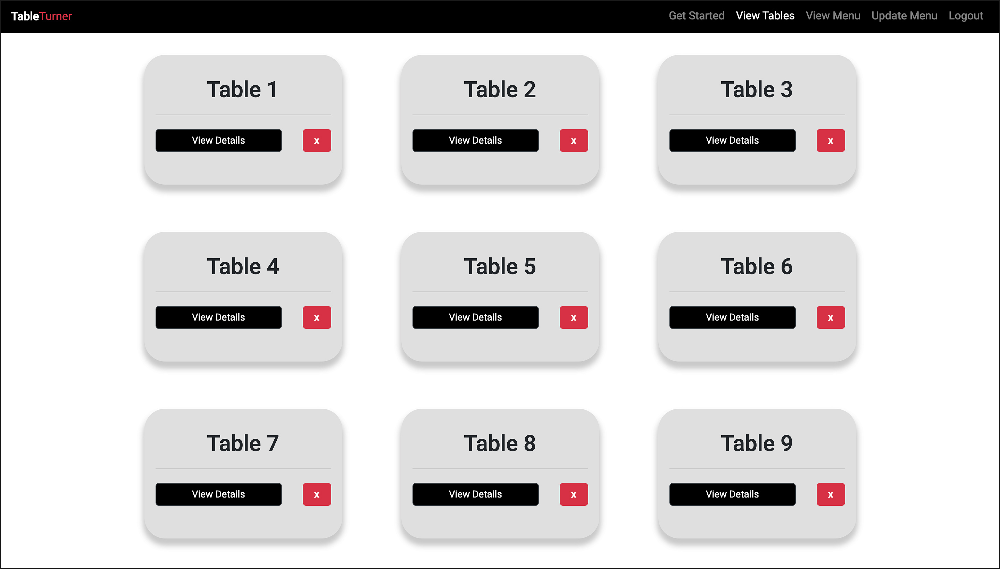
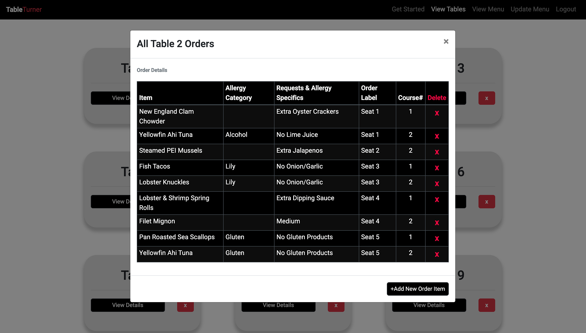
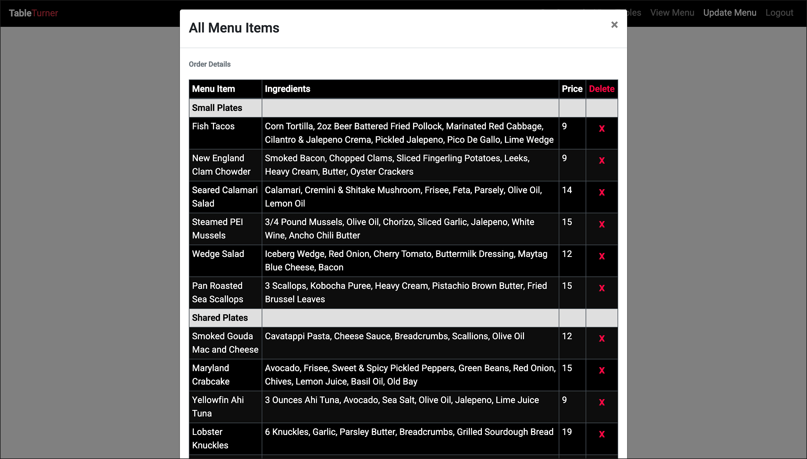

#  TableTurner ‎
‏‏‎
‎‎ 

 

      
  

  ---
  
  
&nbsp;

    

## Description 

&nbsp;

<strong><em>What is this project? Why did you make this project? How did you make this project?</strong></em>

&nbsp;

Table Turner is an application for modern restaurants that are looking to expedite their order fulfillments and place greater visibility on allergy concerns and special order requests from customers. Orders can be placed on a tablet or other mobile device and are immediately available for the kitchen staff to view and begin preparing. The front of the house wait staff can add table numbers and seat labels within each table to add further clarity to orders and keep track of exactly who ordered what. They have the ability to select course numbers to track when dishes should be brought out, check boxes to indicate allergy categories the kitchen should be aware of, and enter additional information about allergy specifics/special requests the guests may have. All orders are stored in a table view section after being placed with their appropriate labels applied. These orders can be removed if customers decide to cancel, or at the end of a shift when the night is over. Tables can be removed as well if the layout changes within the establishment. The team has the abilitty to edit their menu items; they can add new menu items when they develop them, and remove menu items when they have been discontinued or are no longer available. This application is intuitive to use and is developed with tablet + mobile device use in mind.

&nbsp;

View the application here =>‏‏‎ ‎‏‏‎ ‎‏‏‎ ‎‏‏[`TableTurner`](https://tableturner.herokuapp.com/)

&nbsp;

---

&nbsp;

## Table of Contents: 

&nbsp;

* [Usage](#usage)
* [Credits](#credits)
* [Contributors](#contributors)
* [Questions](#questions)

&nbsp;

---

&nbsp;

## Usage

&nbsp;

<strong><em>Instructions and examples for usage + development details:</strong></em>

&nbsp;

Visit the application online @ [`Heroku`](https://tableturner.herokuapp.com/) 

&nbsp;

---

&nbsp;

 

&nbsp;

---

&nbsp;

 

&nbsp;

---

&nbsp;

 

&nbsp;

---

&nbsp;

 

&nbsp;

<!-- ---

&nbsp;

## License

&nbsp;

This project is covered under the MIT license. 

&nbsp;
 -->

---

&nbsp;

## Credits

&nbsp;

<strong><em>Third party assets:</strong></em>

&nbsp;

`Node.js` =>‏‏‎ ‎ ‏‏‎ ‎[An asynchronous event-driven runtime built on Chrome's V8 JavaScript engine.](https://nodejs.org/en/)

&nbsp;‏‏‎‏‏‎ ‎<strong>+</strong>

`Express.js` =>‏‏‎ ‎ ‏‏‎ ‎[A fast, unopinionated, minimalist web framework for Node.js.](https://expressjs.com/)

&nbsp;‏‏‎‏‏‎ ‎<strong>+</strong>

`MongoDB` =>‏‏‎ ‎ ‏‏‎ ‎[The most popular databse for modern apps.](https://www.mongodb.com/)

&nbsp;‏‏‎‏‏‎ ‎<strong>+</strong>

`Mongoose npm` =>‏‏‎ ‎ ‏‏‎ ‎[A MongoDB object modeling tool designed to work in an asynchronous environment. ](https://www.npmjs.com/package/mongoose)

&nbsp;‏‏‎‏‏‎ ‎<strong>+</strong>

`React-Bootstrap` =>‏‏‎ ‎ ‏‏‎ ‎[The world's most popular front-end framework. Rebuilt for React.](https://react-bootstrap.github.io/)

&nbsp;‏‏‎‏‏‎ ‎<strong>+</strong>

`Boostrap / CDN` =>‏‏‎ ‎ ‏‏‎ ‎[The world's most popular framework for building responsive, mobile-first sites.](https://getbootstrap.com/)

&nbsp;‏‏‎‏‏‎ ‎<strong>+</strong>

`bcrypt.js` =>‏‏‎ ‎ ‏‏‎ ‎[A secure password hashing function.](https://www.npmjs.com/package/bcryptjs)

&nbsp;‏‏‎‏‏‎ ‎<strong>+</strong>

`PassportJS` =>‏‏‎ ‎ ‏‏‎ ‎[Simple, unobtrusive authentication for Node.js](https://www.passportjs.org/)

&nbsp;‏‏‎‏‏‎ ‎<strong>+</strong>

`Heroku` =>‏‏‎ ‎ ‏‏‎ ‎[A platform that enables developers to build, run, & operate applications entirely in the cloud.](https://www.heroku.com)

&nbsp;‏‏‎‏‏‎ ‎<strong>+</strong>

`Axios` =>‏‏‎ ‎ ‏‏‎ ‎[Promise based HTTP client for the browser and node.js](https://www.npmjs.com/package/axios)

&nbsp;

`React Toastify` =>‏‏‎ ‎ ‏‏‎ ‎[React-Toastify allows you to add notifications to your app with ease.](https://www.npmjs.com/package/react-toastify)

&nbsp;

---

&nbsp;

## Contributors

&nbsp;

James Lamb 
* [GitHub](https://github.com/Lambaa94) 
* Email => <jameslamb13@gmail.com>

&nbsp;‏‏‎‏‏‎

Robert Greenawalt
* [GitHub](https://github.com/rsg71) 
* Email =>  <robert.greenawalt29@gmail.com>

&nbsp;‏‏‎‏‏‎

Jonathan Schimpf
* [GitHub](https://github.com/jonathanschimpf)
* Email => <jonathan@jonathanschimpf.com>

&nbsp;‏‏‎‏‏‎

Max Goldstein
* [GitHub](https://github.com/maxgoldstein93) 
* Email => <magoldstein93@gmail.com>

&nbsp;

---

&nbsp;

## Questions?

&nbsp;

Reach out to us via GitHub / Email.

&nbsp;

We'd love to discuss this project with you.

&nbsp;

