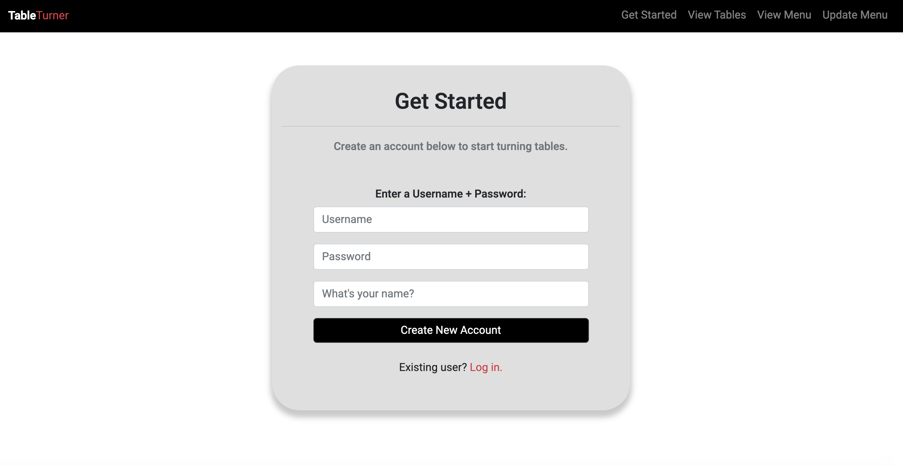
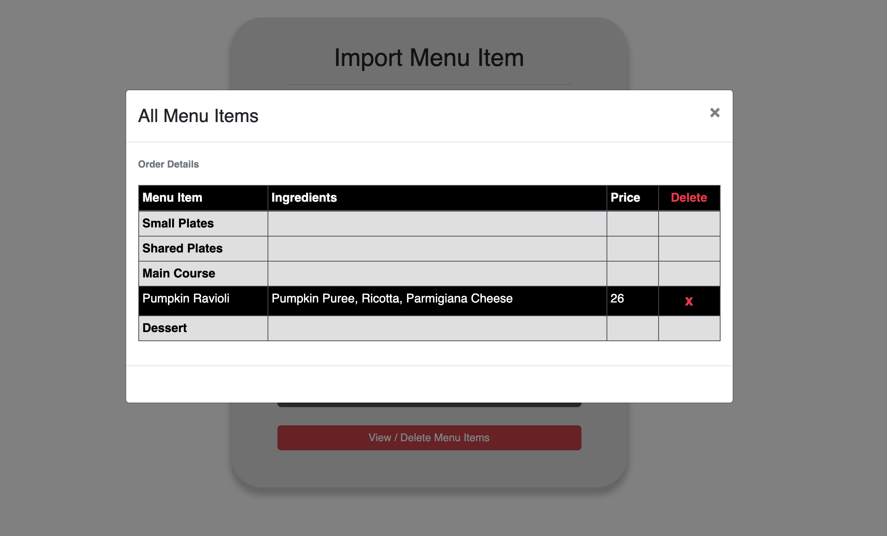
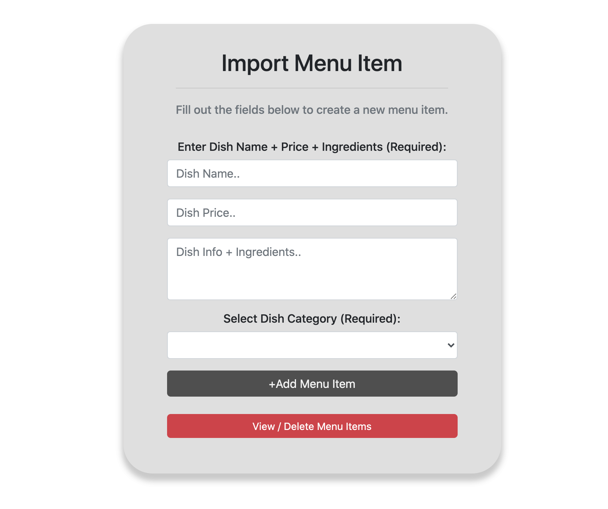
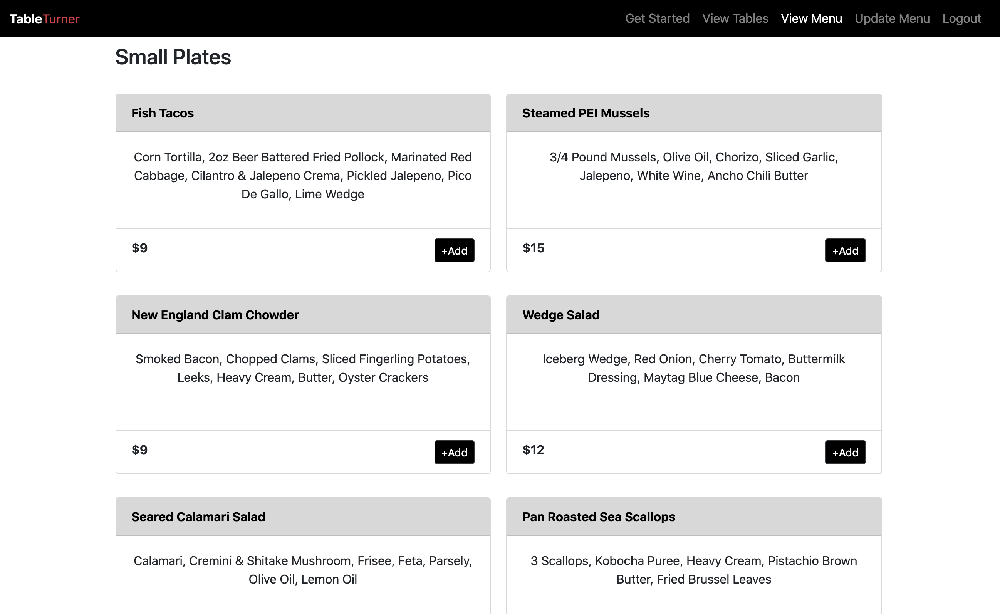

# Table Turner
[CLICK HERE FOR LIVE HEROKU APPLICATION](https://tableturner.herokuapp.com/login)

 


 


      
  

  ---
  
  <p>&nbsp;<p>

## Table of Contents
* [Screenshots](#screenshots)

* [User Story](#user-story)

* [Application Description](#application-description)

* [Installation](#installation)

* [Usage](#usage)

* [Built With](#built-with)

* [Contributors](#contributors)

* [License](#license)

* [Questions](#questions)

<p>&nbsp;<p>

## Screenshots 
)





<p>&nbsp;<p>

## User Story
```
As a Manager, I want to be able to add new menu items to a point of service system and view the menu. I want to create new tables and attach guests to each table for all back of house employee's to see what the guest has ordered. I also want to delete tables as guests finish there dining experience. As the seasons change  I want to be able to update the menu.

```
<p>&nbsp;<p>

## Application Description

An application that lets the user create a menu for guests to view. The user a restaruant manager or employee can add and delete menu items. They can also create new tables of guests and save an order for the back of house to view. The application utilizes react.js using hooks and state to send information through the application. User information is saved in a mongoDB.

## Installation 
```
npm i 
```
<p>&nbsp;<p>

## Usage 
```
Run "npm start to start then navigate to a browser window 

OR
                                     
Use the live application via the Heroku link provided above

```

<p>&nbsp;<p>

## Built With

<p>&nbsp;<p>

`Node.js` =>‏‏‎ ‎ ‏‏‎ ‎[An asynchronous event-driven runtime built on Chrome's V8 JavaScript engine.](https://nodejs.org/en/)


<p>&nbsp;‏‏‎‏‏‎ ‎<strong>+</strong></p>


`Express.js` =>‏‏‎ ‎ ‏‏‎ ‎[A fast, unopinionated, minimalist web framework for Node.js.](https://expressjs.com/)


<p>&nbsp;‏‏‎‏‏‎ ‎<strong>+</strong></p>


`MongoDB` =>‏‏‎ ‎ ‏‏‎ ‎[The most popular databse for modern apps.](https://www.mongodb.com/)


<p>&nbsp;‏‏‎‏‏‎ ‎<strong>+</strong></p>


`Mongoose npm` =>‏‏‎ ‎ ‏‏‎ ‎[A MongoDB object modeling tool designed to work in an asynchronous environment. ](https://www.npmjs.com/package/mongoose)


<p>&nbsp;‏‏‎‏‏‎ ‎<strong>+</strong></p>


`React-Bootstrap` =>‏‏‎ ‎ ‏‏‎ ‎[The world's most popular front-end framework. Rebuilt for React.](https://react-bootstrap.github.io/)


<p>&nbsp;‏‏‎‏‏‎ ‎<strong>+</strong></p>


`Boostrap / CDN` =>‏‏‎ ‎ ‏‏‎ ‎[The world's most popular framework for building responsive, mobile-first sites.](https://getbootstrap.com/)


<p>&nbsp;‏‏‎‏‏‎ ‎<strong>+</strong></p>


`bcrypt.js` =>‏‏‎ ‎ ‏‏‎ ‎[A secure password hashing function.](https://www.npmjs.com/package/bcryptjs)


<p>&nbsp;‏‏‎‏‏‎ ‎<strong>+</strong></p>


`PassportJS` =>‏‏‎ ‎ ‏‏‎ ‎[Simple, unobtrusive authentication for Node.js](https://www.passportjs.org/)


<p>&nbsp;‏‏‎‏‏‎ ‎<strong>+</strong></p>


`Heroku` =>‏‏‎ ‎ ‏‏‎ ‎[A platform that enables developers to build, run, & operate applications entirely in the cloud.](https://www.heroku.com)


<p>&nbsp;‏‏‎‏‏‎ ‎<strong>+</strong></p>

`Axios` =>‏‏‎ ‎ ‏‏‎ ‎[Promise based HTTP client for the browser and node.js](https://www.npmjs.com/package/axios)


<p>&nbsp;<p>

`React Toastify` =>‏‏‎ ‎ ‏‏‎ ‎[React-Toastify allows you to add notifications to your app with ease.](https://www.npmjs.com/package/react-toastify)


<p>&nbsp;<p>


## Contributors 

James Lamb 
* [GitHub](https://github.com/Lambaa94) 
* Email => <jameslamb13@gmail.com>

<p>&nbsp;‏‏‎‏‏‎</p>

Robert Greenawalt
* [GitHub](https://github.com/rsg71) 
* Email =>  <robert.greenawalt29@gmail.com>

<p>&nbsp;‏‏‎‏‏‎</p>

Jonathan Schimpf
* [GitHub](https://github.com/jonathanschimpf)
* Email => <jonathan@jonathanschimpf.com>

<p>&nbsp;‏‏‎‏‏‎</p>

Max Goldstein
* [GitHub](https://github.com/maxgoldstein93) 
* Email => <magoldstein93@gmail.com>


<p>&nbsp;<p>

## License

[](https://opensource.org/licenses/MIT)

Copyright 2020 ©Ian Fusi, Max Goldstein, Kristy Keller, James Lamb

<sup>Permission is hereby granted, free of charge, to any person obtaining a copy of this software and associated documentation files (the "Software"), to deal in the Software without restriction, including without limitation the rights to use, copy, modify, merge, publish, distribute, sublicense, and/or sell copies of the Software, and to permit persons to whom the Software is furnished to do so, subject to the following conditions:
  
<sup>The above copyright notice and this permission notice shall be included in all copies or substantial portions of the Software.
  
<sup>THE SOFTWARE IS PROVIDED "AS IS", WITHOUT WARRANTY OF ANY KIND, EXPRESS OR IMPLIED, INCLUDING BUT NOT LIMITED TO THE WARRANTIES OF MERCHANTABILITY, FITNESS FOR A PARTICULAR PURPOSE AND NONINFRINGEMENT. IN NO EVENT SHALL THE AUTHORS OR COPYRIGHT HOLDERS BE LIABLE FOR ANY CLAIM, DAMAGES OR OTHER LIABILITY, WHETHER IN AN ACTION OF CONTRACT, TORT OR OTHERWISE, ARISING FROM, OUT OF OR IN CONNECTION WITH THE SOFTWARE OR THE USE OR OTHER DEALINGS IN THE SOFTWARE.

## Questions

If you have any questions regarding this repo, please contact any of the above mentioned contributors via Github or email.


